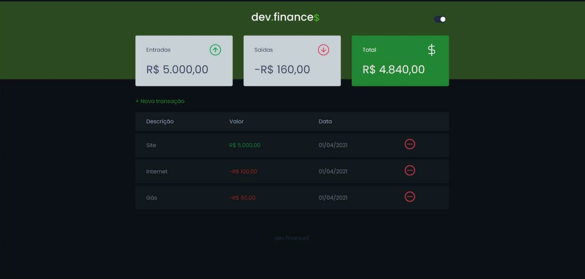

 #  

 
 

Esta aplicação foi desenvolvida na maratona Discover, sob a instrução do [Mayk Brito](https://github.com/maykbrito). 

## Experiência

Além de colocar em prática muito do que eu aprendi até aqui, ampliei meus horizontes em relação ao desenvolvimento. 
Desenvolver não se trata apenas do código, e sim um conjunto de ideias + criatividade + planejamento + muita pesquisa + enfim, 
a tangente vai longe. Dessa forma, me senti mais confiante para desenvolver sem me sentir tão perdido. 😉

## Aplicação

Problemas para gerenciar bem sua vida financeira? Eis a solução: **_dev.finance$_**.  
- Basta criar uma nova transação, informar uma descrição, uma entrada ou saída e a data da transação. Pronto!  
- Você terá seus ganhos ou gastos sob controle! ✔  
- Se não precisa mais da transação, basta excluí-la no ícone de diminutivo, e _(em breve)_, podendo até mesmo editá-la.  
- Não usa desktop? Não tem problema, o **_dev.finance$_** se ajusta para mobile também! 📱✔

## Novas funcionalidades 

Para praticar mais e motivado pelo incentivo da própria maratona, acrescentei mais funcionalidades, como:  
- Dark mode - o famigerado tema escuro dos desenvolvedores. 🧛‍♀️  
- Tratamento de erro - personalizei a captura de erro quando ao menos um ou nenhum campo das transações são preenchidos. 🛠
- Transform: scale - ao passar o mouse ou touch na tabela de transações, os elementos são transformados para uma escala de tamanho maior, 
gerando um efeito agradável. 💆‍♂️
- Editar transações - _(em breve)_.

## Tecnologias

Desenvolvida inteiramente com apenas  
- 
- 
- 
#
📌 https://ryanguilhermee.github.io/dev.finances-discover/
